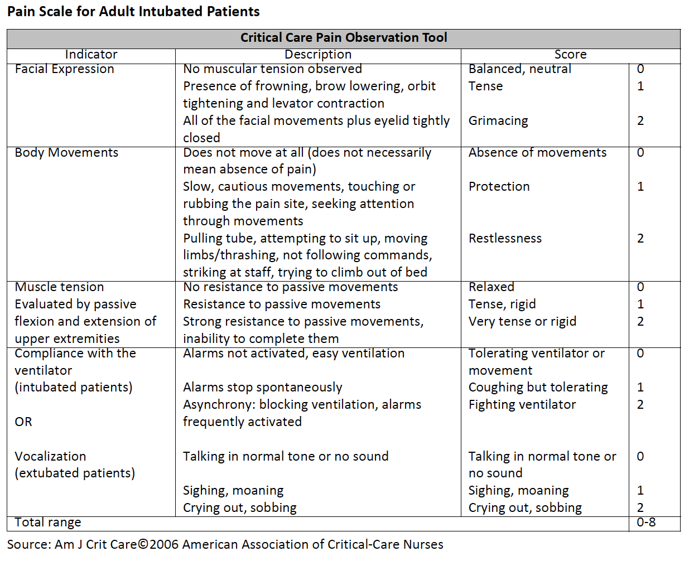
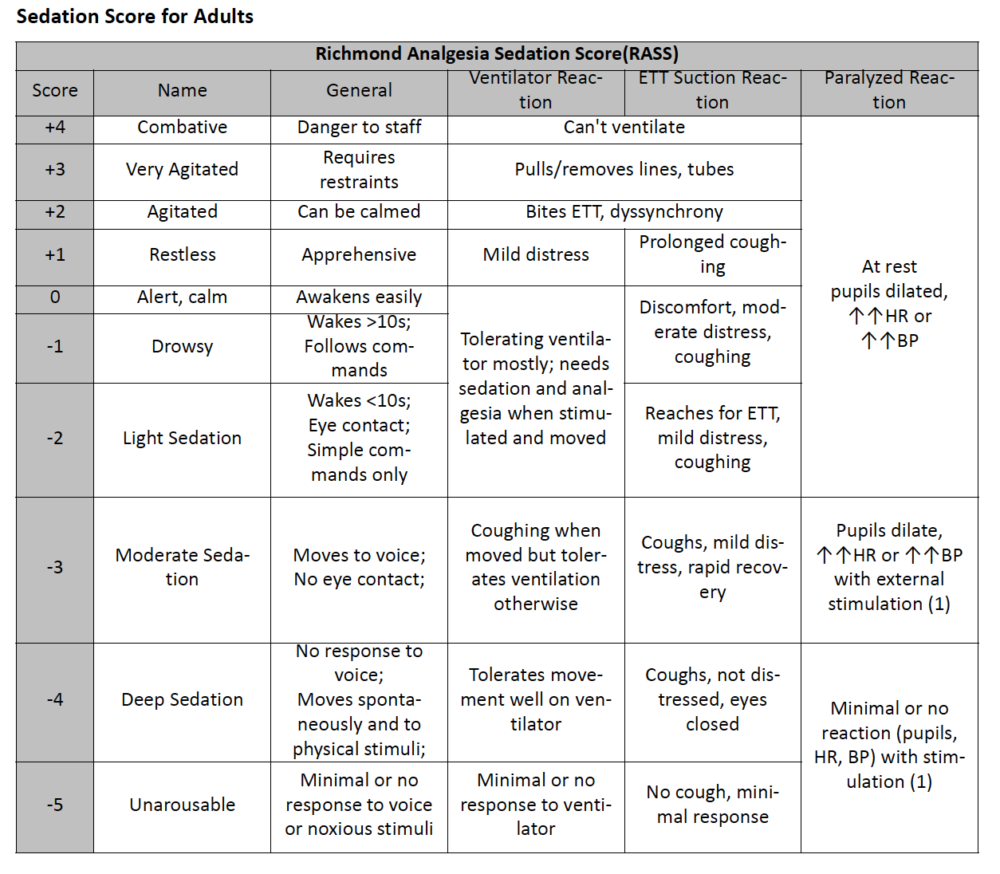

##Ornge Clinical Practice Guideline: Sedation and Pain Management for Intubated and Ventilated Patients
CCPs may administer sedation and analgesia without patching, within the dosage and MAP parameters outlined
below. Caution must be taken to avoid sedation/analgesia related hypotension by titrating dosage slowly and to
effect utilizing the sedation/analgesia scales below. **ALL intubated patients receiving sedation/analgesia should
have a sedation and analgesia score calculated, monitored and documented throughout transport.** Titrate to
Ornge Sedation Score -4, to Pain Score 0-2. All patients should receive both analgesia and sedation (Ketamine can
be utilized alone if required as it provides both analgesia and sedation). If MAPs drop below the lower boundary
then, sedation/analgesia should be reduced or discontinued and action taken to correct the low MAP.

Some clinical conditions require higher MAP parameters to maintain perfusion - utilize a MAP of > 80 as a lower BP
parameter for patients with possible increased ICP (TBI, ICH), ischemic CVA, or spinal cord injury.

