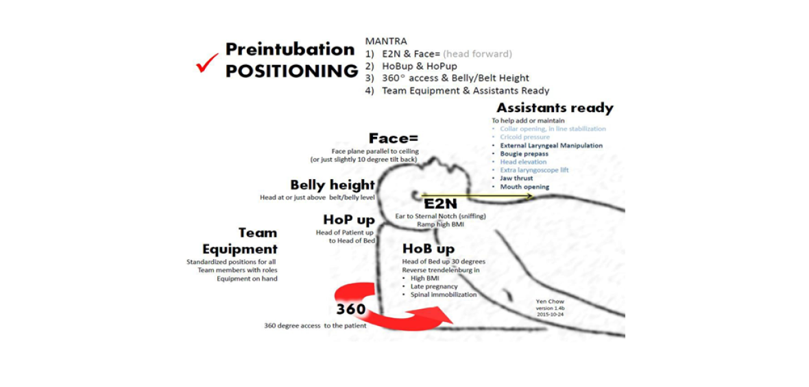

##Ornge Airway Manual-Executive Summary
Version 1.02: January 28, 2016  

<b>Rationale</b>  
Working in the transport setting provides a challenging work place environment. Critically unstable patients
require advanced care, including intubation, in challenging and unfamiliar contexts. The process of intubating
patients in unfamiliar and dynamic settings is complex and many factors potentially contribute to the potential of
an airway failure. These include but are not limited to poor optimization prior to induction, equipment failure,
poor communication, and human error during the intubation process. The goal is to outline a consistent,
structured approach to the rapid sequence induction and intubation of a patient. The adoption of a streamlined,
universal, evidenced based approach to the airway will ensure that any two paramedics are comfortable and
familiar with the intubation process. This standardized approach will ensure a streamlined efficient intubation
process, minimizing failure and planning in advance should failure arise.  

<b>Definitions</b>  

<b>Intubation attempt:</b> An intubation attempt is defined as the insertion of a laryngoscope or the insertion of any
bougie or airway device past the lips for the purpose of securing the airway. First attempt success is not
disqualified by necessary adjustments to the depth of the ETT or re-securing it.  

<b>Rapid Sequence Induction (RSI):</b> An advanced airway procedure used to achieve endotracheal intubation using a
paralytic and an induction agent.  

<b>Crash Intubation:</b> Attempted endotracheal intubation without the use of pretreatment, induction or paralytic in
the moribund patient.

<b>Sedation Facilitated Intubation (SFI):</b> Attempted intubation using a topical anesthetic and sedative or dissociative
agent.

<b>Organizational Goals:</b>  

* Successful intubation on first airway attempt
* No desaturation (SpO2 <90%)
* No hypotension (SBP <90 mmHg)(MAP < 65)
* No other airway complications 
	* Vomiting/Aspiration
	* Hypoventilation
	* Airway trauma caused by intubator
	* Misplacement of tracheal tube
	* Bradycardia
	* Cardiac arrest
	
<b>Benchmarks</b>

* Organizational goals of 85% first intubation attempt success for RSI and 95% overall success for RSI; 75%
first intubation attempt success for all intubations and 90% overall success for all intubations

<b>Organizational Approaches for Intubation</b>  

* Rapid Sequence Intubation (RSI): Critical Care Paramedic (CCP) with another certified intubator within a
facility
* Sedation Facilitated Intubation: ACP(f) or CCP
* Crash Intubation ACP(f) or CCP
* Scene calls with out of hospital times of less than 30 minutes should defer intubation until arrival at the
receiving emergency department unless absolute indications exist which include failure of oxygenation or
ventilation, airway obstruction or impending airway obstruction not relieved by basic airway maneuvers
* Supraglottic airway should be the initial airway strategy in out of hospital cardiac arrest unless Endotracheal
intubation is deemed more appropriate by the paramedic

<b>Pre-intubation Patient Positioning</b>  

<b>Patient Positioning</b>

Proper patient positioning is an essential aspect of the preparation phase prior to intubation. Proper patient
positioning will optimize the view obtained during laryngoscopy, and it will extend the time until hypoxia is
encountered. It will also ensure required airway equipment is within reach and there is adequate physical space for
the team should further interventions be required included BVM, SGA insertion, or cricothyrotomy.
Optimal patient positioning is determined by two major factors: the patient’s physical location within their
environment, and the patients specific positioning.
The premise of the ideal patient location allows team access 360 degrees around the patient with all required
equipment within reach, where the patient is at optimal physical height on an adjustable stretcher and minimizing
physical and environmental distractions.

<b>Hierarchy of Intubation Setting</b>

Hospital bed in resuscitation room> Stretcher outside aircraft/ambulance > On the ground at scene call> In back of
ambulance or aircraft while stationary or during transport

<b>Patients’ Physical Location</b>

Access to the patient’s airway, IVs, monitor and airway equipment is paramount when deciding the best setting for
intubation. We advocate for 360-degree access around the patient under nearly all circumstances. The optimal
location is nearly always a resuscitation room where there is adequate room for set up, however on some calls this
will not be possible. For scene calls the back of an ambulance or the area outside the aircraft is optimal. Optimal
patient positioning is outlined in the figure above. The patient’s head should be at approximately the level of the
umbilicus of the intubator, a horizontal line should intersect the patient’s ear and sternal notch; frequently this will
require manipulation of the patients head or shoulders using equipment nearby including a SAM splint or bed
sheet. The intubator should be at the head of the stretcher and the patient’s face should be horizontal.

<b>Intubation Team Positioning</b>  

The overarching philosophy is to standardize as many aspects as possible regarding the approach to the airway.
Ensuring that ‘cognitive noise’ is reduced in stressful situations. That all Ornge paramedics will be familiar and
comfortable with the process of intubation regardless of experience in the particular intubating setting or with
their paramedic partner.

<b>Team Geography Keys</b>  

* The airway bag may be placed on an adjacent hospital bed or tray table to the intubator's right, or on an
adjacent stretcher or on the floor of the helicopter/road ambulance during scene calls
* The airway bag located between airway assistant and intubator for easy access
* Monitor positioned in direct view of the airway assistant
* 360 degree access to patient wherever possible
* If required, a Manual Inline Stabilization (MILS) assistant may be placed to the left of the intubator,
providing cervical spine stabilization approaching from the patients left side or chest

<b>Airway Bag</b>

The standardized set up of airway equipment is within your standardized airway bag. This ensures that a complete
set of equipment is readily available and prepared for a safe intubation or rescue airway management. Airway
equipment is organized sequentially within the airway bag to correspond with airway interventions.  

Ideally the airway bag should be placed on the intubator’s right. This ensures that both team members will have
timely access to any piece of airway equipment or back-up device. The strength of a standardized airway bag is
familiarity, the location or setup of airway equipment should only be deviated from the norm in extenuating
circumstances.

<b>Airway Checklist</b>

The Ornge intubation checklist should be used on all controlled intubations (RSI, SFI). This tool outlines the
expected minimum standard preparation, equipment, and pre-briefing required for a safe intubation attempt and
it helps provide the best possible chance at first pass intubation success. It also ensures that bystanders and other
health care providers are aware of the airway plan, appropriate backups, and plan for failure. It is important to note
that the airway checklist is meant to be a final check following set up for intubation - it should not be used as a
recipe to organize equipment or discuss management. This should all be done in the 'prepare and plan' stage. It is
analogous to a pilot’s final checks before takeoff or landing-performed rapidly just prior to pushing drugs and
starting time zero for intubation. The preparation has already been completed; the role of the checklist is to ensure
that nothing has been missed. This requires the team to discuss the roles and expectations of each member; e.g.
airway assistant maintain In-line Stabilization (MILS) assistant when required; prior to performing the checklist. The
fail plan should include the initial approach to intubation as well as the expected next steps if a difficult airway is
encountered. This should include a review of the 30 second drilled responses (below) for actions during the
intubation attempt, actions required between intubation attempts, and the predicted approach to subsequent
intubation attempts. Another important point is that the checklist should be done in a challenge-response fashion.
Essentially this means that once the preparation for intubation is complete, the paramedic who opened and
organized the airway bag will read aloud the checklist to their partner who is tasked with checking their partner’s
set up. Each point is meant to be a simple check, not a conversation (except for the team brief). In fact, the entire
checklist should take no longer than 40-45 seconds with practice.

<b>Preoxygenation</b>

A significant number of intubations fail due to, or are complicated by preventable hypoxia often due to insufficient
pre-oxygenation. Adequate pre-oxygenation with 100% O2 maximizing SpO2 >95% (ideally as close to 100% as
possible) and denitrogenation, prolongs safe apneic time before the patient becomes hypoxemic.
To maximize preoxygenation prior to intubation, a patient should be placed on a non-rebreather plus nasal cannula
at flow rate tolerated by the conscious patient or have a bag valve masked placed over their airway for 3-5 mins
with adequate mask seal to avoid entraining room air and enough oxygen flow to meet their minute ventilation; i.e.
BVM reservoir does not fully collapse on inspiration. Adequate tidal volume is also necessary. If passive
oxygenation does not result in adequate pre-oxygenation, positive pressure ventilation (PPV) with BVM should be
initiated. This is best started at the decision to intubate ensuring preoxygenation occurs simultaneously with
intubation preparation. Further, each patient requires high flow nasal cannula ensuring apneic oxygenation using
15 LPM via nasal prongs. This may not be tolerated by awake patients but should be titrated up as high as tolerated
by the patient. Ensure adequate ventilation, RR and chest rise.

<b>Difficulty and/or Hypoxia with intubation (SpO2 <93% during attempt)</b>  

Any time there is encountered or anticipated difficulty intubating; one must change a part of the airway strategy in
order to address the difficulty. This may occur during the attempt or with the next attempt. It is important to use
the most familiar techniques and more familiar equipment during the first attempt by the most experienced
intubator when there is anticipated difficulty, or when difficulty is encountered unexpectedly.

* Stop intubation attempt unless bougie or tube delivery into the trachea is visualized to be occurring (not
blind tube or blind bougie delivery)
* Ventilate with optimized bag valve mask as necessary to re-oxygenate to over 93% (ideally over 95%).
	* 2 person BVM with ETCO2, two thumbs down face mask seal, pull face up into mask
	* Jaw thrust
	* BVM 15LPM + Nasal oxygen 15LPM
	* Oropharyngeal and two nasopharyngeal airways
	* Airways cleared
	* PEEP + Manometer
	* Position head neck upper body optimized
* Failure of optimized BVM to ventilate means a “Can’t-Intubate-Can’t-Oxygenate/Ventilate” scenario where
rescue airway is emergently required.
	* Assess adequacy of ventilation clinically with good chest rise and fall and ETCO2 waveform
	* SpO2 may be delayed to show reoxygenation despite good ventilation, particularly in those at risk for
hypoxia or for those in shock states
* SpO2 <90% and falling+ 2 person BVM + can’t oxygenate/ventilate = Supraglottic Airway (SGA). Assistant
can help with jaw thrust and mouth opening for insertion
* SpO2 < 88% and falling+ SGA + can’t oxygenate/ventilate = cricothyrotomy (> 40kg)
* Patch at first available opportunity to reassess options

If extreme difficulty is anticipated, it is also important to assess the risk and benefit of intubation. Is an alternative
approach better given the current team, scope of practice, equipment, drugs, resources and surrounding
environment?

<b>Drilled Responses to the Difficult Airway</b>

(Blade is in the mouth but you are having difficulty generating a view of the glottis)
If, during intubation, there is difficulty successfully placing the endotracheal tube or if the intubation attempt is
aborted due to hypoxia, it is vital the team flawlessly transition to the next phase of the airway management plan
as verbalized during the airway checklist briefing. However, it is also vitally important the team take a number of
steps to transition from plan A to plan B and to plan C.
A number of HEMS organizations have incorporated the concept of ‘30-second drills’ when dealing with airway
difficulty. The idea is that after initial stabilization and re-oxygenation (see below), there must be a rapid,
coordinated change before a subsequent re-attempt at intubation. This may include changing the operator in
charge of intubation, changing an aspect of the patient positioning to improve success, or changing a piece of
equipment. After a third unsuccessful attempt, it is very unlikely to achieve success with further airway attempts.
At this point a rescue airway should be initiated according to the airway algorithm.

<b>30 Second Drilled Responses to Optimize Attempt at Laryngoscopy (these can be utilized during intubation attempts when encountering difficulty or between intubation attempts):  
Initial Responses (intubator’s two hands AND assistant do FIVE things)

* Extra Laryngeal Manipulation (ELM) - Assistant to maintain with guidance from intubator
* Extra head elevation
* Extra laryngoscope lift (two hands)
* Use Mac blade with Miller technique (use a Mac 4)
* Use bougie if not already in use</b>

<b>Standardized Approach and special considerations</b>  

* Standard Geometry Video Laryngoscopy with bougie should be utilized as the first attempt for all
intubations.
	* As the number of attempts increases, complications and failure rates significantly increase.
	* The rationale of using a standardized approach for the occasional intubator is to maximize competence
using the technique.
	* Using VL on first attempts requires an incremental approach, leading with appropriate high volume suction
to manage fluids which may negatively impact the intubators view. If fluids continue to be present,
“parking” the suction wand in the left side of the hypopharynx in the proximal esophagus may facilitate
improved laryngoscopy.
* Change blade size or type or technique:
	* Progressive landmark identification following the back of the tongue to epiglottis, sweeping tongue to
the left simultaneously followed by laryngeal exposure
		* The intubator should verbalize their progress to facilitate maintenance of team situational
awareness
	* Preferred start in adults with Mac4 blade
	* If epiglottis control is not adequate then use Mac blade with Miller technique to pick up epiglottis tip
	* Consider plunge and withdraw (insert laryngoscope deeply and slowly withdraw until identifiable anatomy
is seen)
	* Consider straight blade right paraglossal technique if trained/practiced
		* Miller blade is inserted at the far right corner of the mouth and passed along the groove between the tongue and tonsil using leftward and anterior pressure to displace the tongue to the left of the laryngoscope and to maintain tongue in this position at all time
* Following failure of laryngoscopy attempt # 1, re-optimizing the attempt, or the addition of Hyperangulated
VL with stylet or bougie should be undertaken.
* Additional attempts should be optimized and undertaken with support of the most experienced intubator.
* BVM with adjuncts including OPA/NPA or SGA should be undertaken at any point when Sp02 is newly < 93%.
* Address tone/muscle relaxation if possible
* Use straight to cuff shaping for styletted endotracheal tube
* Deliver the bougie or styletted tube from the extreme right corner of the mouth and have assistant pull
right cheek for extra space
* On railroading ETT over bougie, keep laryngoscope in position left turn ETT as the tube tip reaches to the
Laryngeal inlet
* Blind bougie as a last resort if only the epiglottis is seen despite best attempts at laryngeal exposure-feel for
tracheal clicks/distal hold up (usually between 24-40 cm)

<b>Video-Laryngoscopy</b>

Video Laryngoscopy (VL) should be used for ALL intubations and ALL intubation attempts should be recorded using
the VL device. VL with a standard geometry (SG) blade should be used for the first attempt. SG blades can be
utilized for direct laryngoscopy if required. If the first attempt fails consider all of the options listed above to
optimize your view and consider switching to a hyper-angulated (HA) blade.