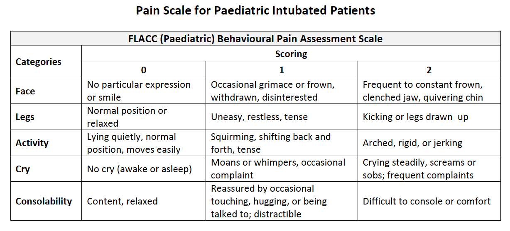

##Ornge Clinical Practice Guideline: Sedation and Pain Management for Intubated and Ventilated Patients

The score is determined by the highest score's description fitting the patient's condition. A patient may have one or more findings at a given score. As a guideline, all intubated patients should be given adequate sedation and analgesia to bring their SBS below 0 with a target of -1. Difficult intubation patients should be kept at a maximum sedation level (SBS -2 to -3) in order to minimize the risk of field extubation and significant adverse events.

The FLACC scale assesses pain by using behavioral indicators and assessment of body movements (face, legs, and activity), verbal responses (cry), and consolability. In an intubated patient, cry should be given a score of 0.
Each category is scored on the 0–2 scale, which results in a total score of 0–10.

				 |		|
------------- | -------------
0  | Relaxed and comfortable
1-3  | Mild discomfort
4-6  | Moderate pain
7-10 | Severe discomfort or pain or both

It is recommended that:

* Sedation and pain scoring / assessment must be completed at the start of normal patient care at a frequency that aligns with the patient’s clinical state
* Sedation scoring should be completed with the patient’s pain assessment every 30 minutes as well as with significant changes in patient condition and also before and after an intervention that affects the patient’s level of sedation

